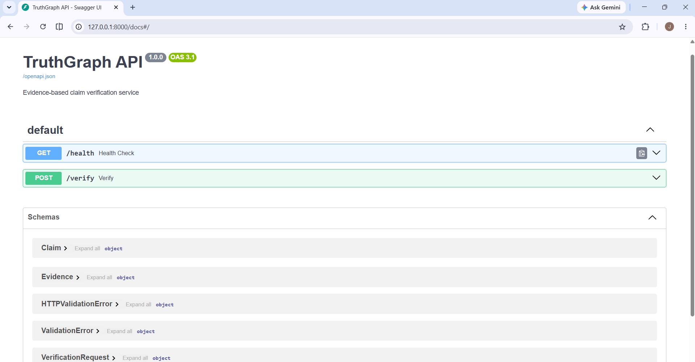

# TruthGraph


TruthGraph is an explainable claim-verification service built with Python and FastAPI. It compares a claim against multiple pieces of evidence, measures textual relevance, considers source reliability, detects contradictions, and returns a structured verdict with a confidence score.

Follow me on X [@tnishant838](https://x.com/tnishant838) for this journey.

## Build Note

As promised on my X account [@tnishant838](https://x.com/tnishant838), TruthGraph was built as part of my hands-on coding practice. I personally configured, ran, debugged, tested, validated, and shipped the system while using AI assistance during parts of the implementation and debugging process.

## Features

- Pydantic-based claim and evidence validation
- Keyword extraction and stop-word removal
- Evidence relevance scoring
- Negation detection
- Numerical contradiction detection
- Source reliability weighting
- Supported, contradicted, or insufficient verdicts
- Confidence-score calculation
- Structured JSON dossier generation
- FastAPI REST endpoints
- Interactive Swagger documentation
- Automated testing with pytest

## API Documentation



## How It Works

1. A claim and one or more evidence items are submitted.
2. The text analyzer normalizes the text and extracts useful keywords.
3. Each evidence item receives a relevance score.
4. Negations and conflicting numbers are checked.
5. Relevance is combined with source reliability.
6. Supporting and contradicting scores are compared.
7. TruthGraph returns a verdict, confidence score, matched keywords, and categorized evidence.

## Architecture

```text
Client
  |
  v
FastAPI
  |
  v
Pydantic Validation
  |
  v
Text Analyzer
  |
  v
Evidence Classifier
  |
  v
Verdict and Confidence Engine
  |
  v
JSON Verification Report
```

## Project Structure

```text
truthgraph/
├── app/
│   ├── models/
│   │   ├── claim.py
│   │   ├── evidence.py
│   │   └── results.py
│   ├── services/
│   │   ├── text_analyzer.py
│   │   └── verifier.py
│   └── api.py
├── data/
├── docs/
│   └── swagger-ui.png
├── reports/
│   └── verification_report.json
├── tests/
│   ├── test_api.py
│   ├── test_text_analyzer.py
│   └── test_verifier.py
├── main.py
├── requirements.txt
└── README.md
```

## Installation

Clone the repository:

```bash
git clone https://github.com/nishanttyagi28/truthgraph.git
cd truthgraph
```

Create a Python 3.12 virtual environment:

```bash
py -V:3.12 -m venv .venv
```

Activate it in Windows PowerShell:

```powershell
.venv\Scripts\Activate.ps1
```

Install the dependencies:

```bash
python -m pip install -r requirements.txt
```

## Run the Command-Line Version

```bash
python main.py
```

The generated verification report is saved at:

```text
reports/verification_report.json
```

## Run the API

```bash
python -m uvicorn app.api:app --reload
```

Open the interactive Swagger documentation:

```text
http://127.0.0.1:8000/docs
```

## API Endpoints

### Health Check

```http
GET /health
```

Response:

```json
{
  "status": "healthy"
}
```

### Verify a Claim

```http
POST /verify
```

Example request:

```json
{
  "claim": {
    "text": "Earth has one natural satellite."
  },
  "evidence": [
    {
      "text": "Earth has one natural satellite called the Moon.",
      "source": "NASA",
      "reliability": 0.95
    }
  ]
}
```

Example response:

```json
{
  "claim": "Earth has one natural satellite.",
  "verdict": "supported",
  "confidence": 0.95,
  "supporting_evidence": [
    {
      "text": "Earth has one natural satellite called the Moon.",
      "source": "NASA",
      "reliability": 0.95
    }
  ],
  "contradicting_evidence": [],
  "matched_keywords": [
    "earth",
    "natural",
    "one",
    "satellite"
  ]
}
```

## Verification Logic

TruthGraph uses deterministic and inspectable rules:

- Common stop words are removed before comparison.
- Claim and evidence keywords are compared.
- Low-relevance evidence is ignored.
- Different numerical values can indicate a contradiction.
- A negation mismatch can indicate a contradiction.
- Relevance is weighted by source reliability.
- Supporting and contradicting scores produce the final verdict.
- Close or missing evidence produces an insufficient verdict.

## Testing

Run the complete test suite:

```bash
python -m pytest -v
```

Current result:

```text
9 passed
```

The tests cover:

- Tokenization
- Stop-word removal
- Keyword relevance
- Negation detection
- Number extraction
- Supported claims
- Contradicted claims
- Insufficient evidence
- Health endpoint
- Verification endpoint

## Current Limitations

TruthGraph currently uses deterministic verification rules. It does not independently search the internet, understand the complete semantic meaning of a statement, or guarantee that submitted evidence is factually correct.

Source reliability is currently supplied by the caller. The confidence score represents the internal strength of the submitted evidence, not universal factual certainty.

## Next Version

The next version of TruthGraph will be significantly more advanced. I will use coding agents to maximize development speed and output. However, the core idea, product direction, system design, architecture, verification philosophy, and final technical decisions will remain mine. All agent-generated implementation will be reviewed, tested, and accepted against my intended architecture.

Planned additions include:

- Automated evidence collection from external sources
- Claim decomposition into smaller verifiable questions
- Semantic similarity using embeddings
- Hybrid keyword and vector retrieval
- Evidence reranking
- Source reputation registry
- LLM-assisted contradiction analysis
- RAG-based evidence retrieval
- LangGraph investigation workflow
- Persistent verification history
- Independent evidence-quality assessment
- Advanced evaluation and observability
- Docker deployment and CI/CD

## Author

Built by [Nishant Tyagi](https://github.com/nishanttyagi28).

Follow me on X [@tnishant838](https://x.com/tnishant838) for this journey.